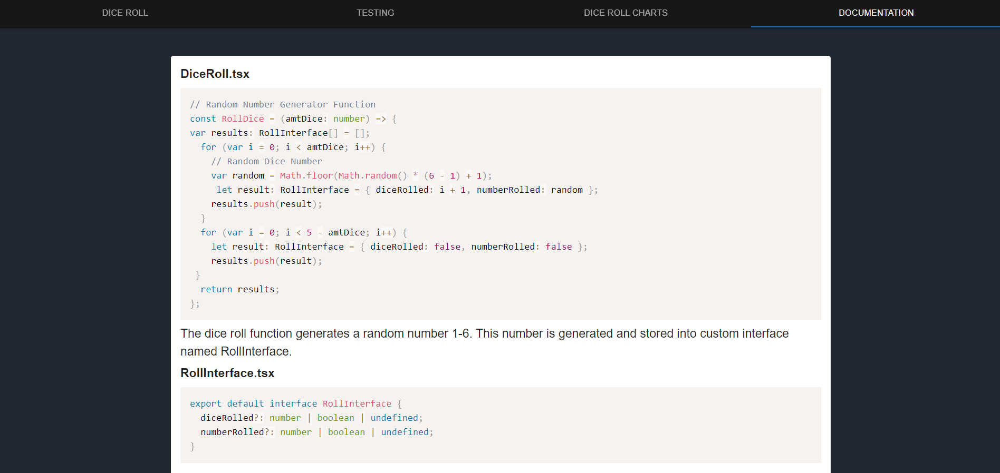

# Randomness Webapp For Introduction Into Software Testing
## WSU University 2021

# Install Dependencies

### `npm install`

## Launch Development Server

### `npm start`

Open [http://localhost:3000](http://localhost:3000) to view it in the browser.

The page will reload if you make edits.\
You will also see any lint errors in the console.

## Live Site

[https://www.ceg3110-diceroll-miller.com/](https://www.ceg3110-diceroll-miller.com/)

## Documentation available on site

